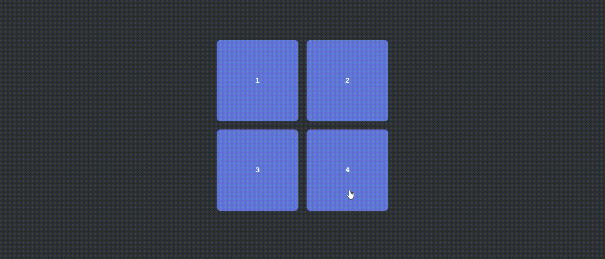

# JavaScript : Exercice III 💻 #
## - Créer une page web avec 4 carrés adoptant une disposition particulière - ##

 

### Objectifs : ###
***Créer une page web affichant 4 carrés de 200 x 200 pixels avec un fond vert adoptant la disposition suivante. Ils seront numérotés de 1 à 4.***

→ En cliquant sur n'importe quel carré, celui-ci : 
      <ul><ul>
        <li>rétrécit de 10%</li>
        <li>décrit une rotation de 360 degrés</li>
        <li>prend un fond d'une couleur différente.</li>
      </ul></ul>
→ En recliquant dessus, le carré reprend ses propriétés initiales.

 

### ⚙️ Langages utilisés ⚙️ ###

 

### Preview : ###
</img>

 

*Note : exercice fourni par <a href="https://elan-formation.fr/accueil">Elan Formation</a>*